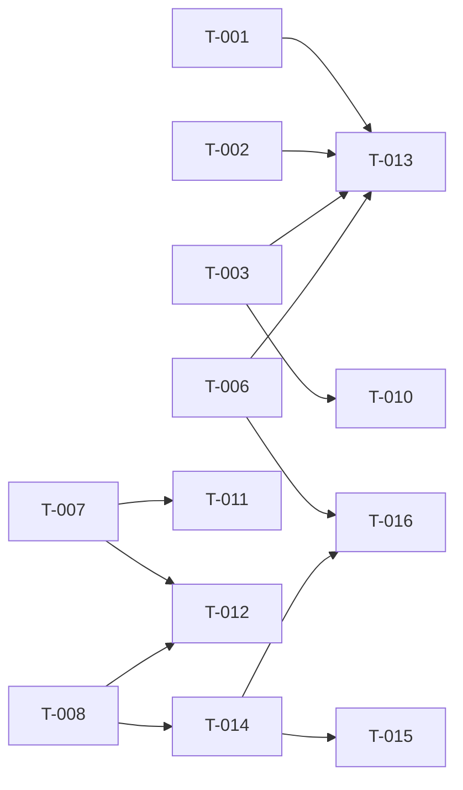
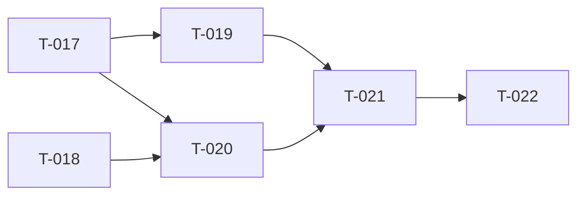

# Build Site: Caveman Code
**Generated:** 2026-04-09
**Source Kits:** cavekit-brand-cleanup, cavekit-visual-theme, cavekit-startup-experience, cavekit-documentation, cavekit-rtk-integration
**Total Tasks:** 22 (16 rebrand [DONE] + 6 RTK)
**Tiers:** 5 (3 rebrand [DONE] + 2 RTK)
**Coverage:** 91/91 ACs mapped (72 rebrand + 19 RTK)

---

## Tier 0 -- No Dependencies (Start Here)

### T-001: Process Title, Onboarding Hint, and Tmux Warning Text
**Cavekit Requirements:** brand-cleanup/R1, brand-cleanup/R2, brand-cleanup/R3
**Acceptance Criteria Mapped:**
- R1/AC-1: cli.ts sets process.title to "cave"
- R1/AC-2: bun/cli.ts sets process.title to "cave"
- R1/AC-3: No file sets process.title containing "pi"
- R2/AC-1: interactive-mode.ts contains "Cave can explain"
- R2/AC-2: Does not contain "Pi can explain"
- R3/AC-1: interactive-mode.ts contains "Cave works best"
- R3/AC-2: Does not contain "Pi works best"
**blockedBy:** none
**Effort:** S
**Description:**
1. Open `packages/coding-agent/src/cli.ts` -- find and replace `process.title` assignment to `"cave"`.
2. Open `packages/coding-agent/src/bun/cli.ts` -- same change.
3. Open `packages/coding-agent/src/modes/interactive/interactive-mode.ts` -- replace `"Pi can explain"` with `"Cave can explain"` and `"Pi works best"` with `"Cave works best"`.
4. Run `grep -rn 'process\.title' packages/` to confirm no remaining "pi" references in process.title.
**Files:**
- `packages/coding-agent/src/cli.ts`
- `packages/coding-agent/src/bun/cli.ts`
- `packages/coding-agent/src/modes/interactive/interactive-mode.ts`
**Test Strategy:** Grep for `process.title` across packages/ -- all values must be "cave". Grep interactive-mode.ts for "Pi can explain" and "Pi works best" -- zero hits.

### T-002: System Prompt References
**Cavekit Requirement:** brand-cleanup/R4
**Acceptance Criteria Mapped:**
- R4/AC-1: system-prompt.ts has no "Pi documentation"
- R4/AC-2: system-prompt.ts has "Cave documentation"
- R4/AC-3: Grep \bPi\b returns zero user-facing hits
**blockedBy:** none
**Effort:** S
**Description:**
1. Open `packages/coding-agent/src/core/system-prompt.ts`.
2. Replace all instances of `"Pi documentation"` with `"Cave documentation"`.
3. Grep for `\bPi\b` in the file -- review each hit. Replace user-facing occurrences. Leave comments/license headers intact.
**Files:**
- `packages/coding-agent/src/core/system-prompt.ts`
**Test Strategy:** `grep -Pn '\bPi\b' packages/coding-agent/src/core/system-prompt.ts` -- zero non-comment hits. Confirm "Cave documentation" present.

### T-003: Config URLs -- Share Viewer and Bun Binary Update
**Cavekit Requirements:** brand-cleanup/R5, brand-cleanup/R6
**Acceptance Criteria Mapped:**
- R5/AC-1: config.ts has no "pi.dev/session/"
- R5/AC-2: Replacement is empty string (disabled)
- R6/AC-1: config.ts has no "badlogic/pi-mono/releases"
- R6/AC-2: Replacement contains "JuliusBrussee/caveman-cli/releases"
**blockedBy:** none
**Effort:** S
**Description:**
1. Open `packages/coding-agent/src/config.ts`.
2. Find `DEFAULT_SHARE_VIEWER_URL` -- set value to `""` (empty string).
3. Find the binary update URL containing `"badlogic/pi-mono/releases"` -- replace with `"JuliusBrussee/caveman-cli/releases"` (preserve the rest of the URL structure).
**Files:**
- `packages/coding-agent/src/config.ts`
**Test Strategy:** Grep config.ts for "pi.dev/session/" and "badlogic/pi-mono/releases" -- zero hits. Confirm empty string for share viewer. Confirm "JuliusBrussee/caveman-cli/releases" present.

### T-004: Binary Release Artifact Names
**Cavekit Requirement:** brand-cleanup/R7
**Acceptance Criteria Mapped:**
- R7/AC-1: build-binaries.sh no output filenames starting with pi-
- R7/AC-2: build-binaries.yml no artifact names starting with pi-
- R7/AC-3: All use cave- prefix
**blockedBy:** none
**Effort:** S
**Description:**
1. Open `scripts/build-binaries.sh` -- find all output filename patterns starting with `pi-` and replace with `cave-`.
2. Open `.github/workflows/build-binaries.yml` -- find all artifact name references starting with `pi-` and replace with `cave-`.
3. Verify consistency between the two files.
**Files:**
- `scripts/build-binaries.sh`
- `.github/workflows/build-binaries.yml`
**Test Strategy:** `grep -n 'pi-' scripts/build-binaries.sh .github/workflows/build-binaries.yml` -- zero hits for artifact names. Confirm `cave-` prefix present in both.

### T-005: Test Script Paths
**Cavekit Requirement:** brand-cleanup/R8
**Acceptance Criteria Mapped:**
- R8/AC-1: test.sh has no $HOME/.pi/
- R8/AC-2: test.sh references $HOME/.cave/agent/auth.json
**blockedBy:** none
**Effort:** S
**Description:**
1. Open `test.sh`.
2. Replace all `$HOME/.pi/` paths with `$HOME/.cave/`.
3. Confirm `$HOME/.cave/agent/auth.json` is present.
**Files:**
- `test.sh`
**Test Strategy:** `grep '\.pi/' test.sh` -- zero hits. Confirm `.cave/agent/auth.json` present.

### T-006: Earendil Announcement Text
**Cavekit Requirement:** brand-cleanup/R9
**Acceptance Criteria Mapped:**
- R9/AC-1: earendil-announcement.ts has no "Cave Pi"
- R9/AC-2: Contains "Caveman Code"
**blockedBy:** none
**Effort:** S
**Description:**
1. Open `packages/coding-agent/src/modes/interactive/components/earendil-announcement.ts`.
2. Replace all instances of `"Cave Pi"` with `"Caveman Code"`.
3. Verify no remaining "Cave Pi" strings.
**Files:**
- `packages/coding-agent/src/modes/interactive/components/earendil-announcement.ts`
**Test Strategy:** `grep 'Cave Pi' earendil-announcement.ts` -- zero hits. `grep 'Caveman Code' earendil-announcement.ts` -- at least one hit.

### T-007: Dark Theme Background Palette
**Cavekit Requirement:** visual-theme/R1
**Acceptance Criteria Mapped:**
- R1/AC-1: dark.json primary bg in #1a1b2e-#1e1f35 range
- R1/AC-2: Card/tool/export bgs in same navy hue family
- R1/AC-3: No warm hue backgrounds (except semantic)
**blockedBy:** none
**Effort:** M
**Description:**
1. Open `packages/coding-agent/src/modes/interactive/theme/dark.json`.
2. Identify all background-related keys (primary bg, card bg, tool bg, export bg, etc.).
3. Set primary background to a value in the #1a1b2e-#1e1f35 range (e.g., `#1c1d30`).
4. Set card, tool, and export backgrounds to navy-hue variants (hue 230-250, varying lightness).
5. Audit all background values -- any with warm hue (0-60 or 300-360) must be replaced with cool navy equivalents, except semantic colors (error, warning).
**Files:**
- `packages/coding-agent/src/modes/interactive/theme/dark.json`
**Test Strategy:** Parse all background color values from dark.json. Verify primary bg is in range. Verify all bg keys have hue 230-250. Verify no warm-hue backgrounds except error/warning semantic colors.

### T-008: Dark Theme Accent Color and Brand Color Slot
**Cavekit Requirements:** visual-theme/R2, visual-theme/R3
**Acceptance Criteria Mapped:**
- R2/AC-1: dark.json accent is #00d7ff (or deltaE < 5)
- R2/AC-2: No #8abeb7 in dark.json
- R3/AC-1: dark.json has key with "brand" in name, value #E8A840
- R3/AC-2: theme-schema.json defines brand slot if schema exists
- R3/AC-3: light.json has brand key
- R3/AC-4: (R3/AC-4 is AC-3 of R3 -- light.json brand key, covered in T-012)
**blockedBy:** none
**Effort:** M
**Description:**
1. Open `dark.json` -- find the accent color key and set its value to `#00d7ff`.
2. Search for `#8abeb7` in `dark.json` -- remove/replace all instances with `#00d7ff` or appropriate navy-palette variant.
3. Add a `"brand"` key (or `"brandColor"`) to `dark.json` with value `"#E8A840"`.
4. Check if `packages/coding-agent/src/modes/interactive/theme/theme-schema.json` exists. If it does, add the brand color slot definition. If not, note as not applicable.
5. Open `light.json` and add the same brand key with value `"#E8A840"`.
**Files:**
- `packages/coding-agent/src/modes/interactive/theme/dark.json`
- `packages/coding-agent/src/modes/interactive/theme/light.json`
- `packages/coding-agent/src/modes/interactive/theme/theme-schema.json` (if exists)
**Test Strategy:** Verify dark.json accent value is #00d7ff. Grep dark.json for #8abeb7 -- zero hits. Verify brand key exists in both dark.json and light.json with #E8A840. Check schema if applicable.

### T-009: Documentation Link Fixes -- AGENTS.md, Package.json URLs, Prompt Templates, Issue Templates
**Cavekit Requirements:** documentation/R4, documentation/R5, documentation/R6, documentation/R7
**Acceptance Criteria Mapped:**
- R4/AC-1: AGENTS.md no badlogic/pi-mono/issues in link templates
- R4/AC-2: AGENTS.md no badlogic/pi-mono/pull in link templates
- R4/AC-3: Issues point to JuliusBrussee/caveman-cli/issues
- R4/AC-4: PRs point to JuliusBrussee/caveman-cli/pull
- R5/AC-1: No package.json has "badlogic/pi-mono.git" in repository.url
- R5/AC-2: All use git+https://github.com/JuliusBrussee/caveman-cli.git
- R6/AC-1: .pi/prompts/cl.md no badlogic issue links
- R6/AC-2: .pi/prompts/cl.md no badlogic pull links
- R6/AC-3: .pi/prompts/pr.md no badlogic pull links
- R6/AC-4: All prompt link templates reference JuliusBrussee/caveman-cli
- R7/AC-1: contribution.yml no badlogic/pi-mono URLs
- R7/AC-2: Contributing link points to JuliusBrussee/caveman-cli
**blockedBy:** none
**Effort:** M
**Description:**
1. Open `AGENTS.md` -- replace all `github.com/badlogic/pi-mono/issues` with `github.com/JuliusBrussee/caveman-cli/issues`. Replace all `github.com/badlogic/pi-mono/pull` with `github.com/JuliusBrussee/caveman-cli/pull`.
2. Find all `package.json` files with `repository.url` containing `badlogic/pi-mono.git`. Replace each with `git+https://github.com/JuliusBrussee/caveman-cli.git`.
3. Open `.pi/prompts/cl.md` and `.pi/prompts/pr.md` -- replace all `badlogic/pi-mono` link templates with `JuliusBrussee/caveman-cli`.
4. Open `.github/ISSUE_TEMPLATE/contribution.yml` -- replace all `badlogic/pi-mono` URLs with `JuliusBrussee/caveman-cli`.
**Files:**
- `AGENTS.md`
- All `package.json` files with repository.url field
- `.pi/prompts/cl.md`
- `.pi/prompts/pr.md`
- `.github/ISSUE_TEMPLATE/contribution.yml`
**Test Strategy:** `grep -rn 'badlogic/pi-mono' AGENTS.md .pi/prompts/ .github/ISSUE_TEMPLATE/ */package.json` -- zero hits (excluding CHANGELOG). Confirm JuliusBrussee/caveman-cli present in all replaced locations.

---

## Tier 1 -- Depends on Tier 0

### T-010: CLI Args Help Text
**Cavekit Requirement:** brand-cleanup/R10
**Acceptance Criteria Mapped:**
- R10/AC-1: args.ts has no "pi.dev/session/" in help text
**blockedBy:** T-003
**Effort:** S
**Description:**
1. Open `packages/coding-agent/src/cli/args.ts`.
2. Find any reference to `"pi.dev/session/"` in help text or env var descriptions.
3. Remove or replace with appropriate caveman-cli reference (or empty since share viewer is disabled per R5).
**Files:**
- `packages/coding-agent/src/cli/args.ts`
**Test Strategy:** `grep 'pi.dev/session/' packages/coding-agent/src/cli/args.ts` -- zero hits.

### T-011: Dark Theme Border Colors
**Cavekit Requirement:** visual-theme/R4
**Acceptance Criteria Mapped:**
- R4/AC-1: Every border color lightness <= 25%
- R4/AC-2: Border colors cool hue (200-270) or achromatic
**blockedBy:** T-007
**Effort:** S
**Description:**
1. Open `dark.json` (already modified by T-007).
2. Identify all border-related color keys.
3. Adjust each border color to have HSL lightness <= 25% and hue in 200-270 range (or achromatic with saturation < 5%).
4. Suggested values: borders around `#252740` (hue ~235, L ~14%) or `#2a2c48` (hue ~237, L ~22%).
**Files:**
- `packages/coding-agent/src/modes/interactive/theme/dark.json`
**Test Strategy:** Parse all border color values. Verify L <= 25% and hue 200-270 or sat < 5% for each.

### T-012: Dark Theme Interactive States and Light Theme Complement
**Cavekit Requirements:** visual-theme/R5, visual-theme/R6
**Acceptance Criteria Mapped:**
- R5/AC-1: User message bg hue 220-260
- R5/AC-2: Selected bg hue 220-260
- R5/AC-3: Neither has warm hue
- R6/AC-1: light.json accent same hue +/-15 as dark accent
- R6/AC-2: light.json has brand key with amber
- R6/AC-3: light.json primary bg L > 90%
**blockedBy:** T-007, T-008
**Effort:** M
**Description:**
1. Open `dark.json` -- find user message background and selected/highlighted background keys.
2. Set both to navy-tone values with hue 220-260 (e.g., user msg bg: `#232545`, selected bg: `#2a2d52`).
3. Open `light.json` -- set accent color to a value with same hue as dark accent (#00d7ff, hue ~187) within +/-15 degrees. A darker/lighter cyan variant works (e.g., `#00b8d4`).
4. Confirm light.json has brand key with `#E8A840` (should already exist from T-008).
5. Confirm light.json primary background has HSL L > 90%.
**Files:**
- `packages/coding-agent/src/modes/interactive/theme/dark.json`
- `packages/coding-agent/src/modes/interactive/theme/light.json`
**Test Strategy:** Parse user message bg and selected bg from dark.json -- hue must be 220-260, not warm. Parse light.json accent -- hue within +/-15 of dark accent hue. Confirm brand key. Confirm primary bg L > 90%.

### T-013: Root README, Coding Agent README, and Contributing Guide
**Cavekit Requirements:** documentation/R1, documentation/R2, documentation/R3
**Acceptance Criteria Mapped:**
- R1/AC-1: README.md contains "Caveman Code" in first heading/paragraph
- R1/AC-2: No "Cave Pi" as product name
- R1/AC-3: Config dir as ~/.cave/
- R1/AC-4: Env vars with CAVE_ prefix
- R1/AC-5: Attribution to upstream pi-mono
- R1/AC-6: References JuliusBrussee/caveman-cli
- R2/AC-1: coding-agent README contains "Caveman Code" or "Cave"
- R2/AC-2: Not presented as upstream pi-mono
- R2/AC-3: Contains upstream attribution
- R3/AC-1: CONTRIBUTING.md contains "Caveman Code" in title/opening
- R3/AC-2: No "Cave Pi" as product name
- R3/AC-3: Retains upstream sync instructions
- R3/AC-4: References upstream URL in sync instructions
**blockedBy:** T-001, T-002, T-003, T-006
**Effort:** L
**Description:**
1. Rewrite `README.md`:
   - First heading or paragraph must include "Caveman Code".
   - Replace all "Cave Pi" with "Caveman Code".
   - Replace `~/.pi/` paths with `~/.cave/`.
   - Replace `PI_` env var prefixes with `CAVE_` in documentation text.
   - Add attribution: "Forked from [pi-mono](https://github.com/badlogic/pi-mono) by badlogic."
   - Reference `JuliusBrussee/caveman-cli` for the fork URL.
2. Rewrite `packages/coding-agent/README.md`:
   - Replace product name with "Caveman Code" or "Cave".
   - Add upstream attribution.
   - Do not present as the upstream project.
3. Rewrite `CONTRIBUTING.md`:
   - Title: "Contributing to Caveman Code".
   - No "Cave Pi" as product name.
   - Keep upstream sync instructions referencing `https://github.com/badlogic/pi-mono.git`.
**Files:**
- `README.md`
- `packages/coding-agent/README.md`
- `CONTRIBUTING.md`
**Test Strategy:** Grep each file for "Cave Pi" -- zero hits. Grep README.md for "Caveman Code", "~/.cave/", "CAVE_", "pi-mono", "JuliusBrussee/caveman-cli" -- at least one hit each. Grep coding-agent README for "Caveman Code" or "Cave" and upstream attribution. Grep CONTRIBUTING.md for "Caveman Code", upstream URL, no "Cave Pi".

---

## Tier 2 -- Depends on Tier 1

### T-014: ASCII Art Logo
**Cavekit Requirement:** startup-experience/R1
**Acceptance Criteria Mapped:**
- R1/AC-1: ASCII art 3-5 lines tall
- R1/AC-2: Rendered in brand color (from visual-theme R3)
- R1/AC-3: Contains "Caveman Code"
**blockedBy:** T-008
**Effort:** M
**Description:**
1. Create or modify the startup header component to include ASCII art.
2. Design a 3-5 line ASCII art block that reads "Caveman Code" (stylized is acceptable).
3. Use the theme's brand color key (established in T-008) to color the ASCII art output.
4. Integrate into the startup rendering path in `interactive-mode.ts` or its header component.
**Files:**
- `packages/coding-agent/src/modes/interactive/components/` (new or modified header component)
- `packages/coding-agent/src/modes/interactive/interactive-mode.ts`
**Test Strategy:** Launch the CLI and capture startup output. Verify ASCII art is 3-5 lines. Verify "Caveman Code" is readable. Verify brand color (#E8A840) is used in rendering.

### T-015: Version Display and Keybinding Hints
**Cavekit Requirements:** startup-experience/R2, startup-experience/R3
**Acceptance Criteria Mapped:**
- R2/AC-1: Version string matching semver
- R2/AC-2: Muted/dim style
- R2/AC-3: Matches package.json version
- R3/AC-1: At least 3 keybinding hints
- R3/AC-2: Muted/dim style
- R3/AC-3: Each shows key name and action
**blockedBy:** T-014
**Effort:** M
**Description:**
1. In the startup header component (created/modified in T-014), add version display.
2. Read version from `package.json` or the existing version constant.
3. Render version in muted/dim style (not accent or brand color).
4. Add keybinding hints section below or beside the logo. Include at least 3 hints (e.g., `Escape` -- cancel, `Enter` -- submit, `/` -- commands).
5. Render hints in muted/dim style with format: `key: action`.
**Files:**
- `packages/coding-agent/src/modes/interactive/components/` (startup header component)
**Test Strategy:** Capture startup output. Verify semver pattern present. Verify at least 3 key hints with key+action format. Compare version against package.json.

### T-016: Cave Mode Status Line and Earendil Announcement Removal
**Cavekit Requirements:** startup-experience/R4, startup-experience/R5
**Acceptance Criteria Mapped:**
- R4/AC-1: When active: line with "cave mode" and "compression"
- R4/AC-2: Muted cyan styling
- R4/AC-3: Not shown when inactive
- R5/AC-1: EarendilAnnouncementComponent not rendered at startup
- R5/AC-2: Component file removed or not imported
- R5/AC-3: No boxed banner at startup
**blockedBy:** T-006, T-014
**Effort:** M
**Description:**
1. In the startup header, add conditional cave mode status line.
2. Check whether cave mode is active at startup. If active, render a line containing "cave mode" and "compression" in muted cyan (accent color dim variant).
3. If cave mode is not active, skip this line entirely.
4. Remove `EarendilAnnouncementComponent` from the startup rendering in `interactive-mode.ts`.
5. Remove or comment out the import of `earendil-announcement.ts` from the startup path. Optionally delete the file if no other code references it.
6. Verify no boxed/bordered banner appears at startup.
**Files:**
- `packages/coding-agent/src/modes/interactive/interactive-mode.ts`
- `packages/coding-agent/src/modes/interactive/components/earendil-announcement.ts` (remove or disconnect)
- `packages/coding-agent/src/modes/interactive/components/` (startup header component)
**Test Strategy:** Launch with cave mode active -- verify "cave mode" and "compression" line present in cyan. Launch without -- verify line absent. Verify no EarendilAnnouncement rendering. Grep interactive-mode.ts for EarendilAnnouncement import -- zero hits.

---

## Summary

| Tier | Tasks | Total ACs |
|------|-------|-----------|
| 0    | T-001 through T-009 | 44 |
| 1    | T-010 through T-013 | 18 |
| 2    | T-014 through T-016 | 10 |
| **Total** | **16** | **72** |

---

## Dependency Graph

**Parallelization notes:**
- Tier 0: All 9 tasks (T-001 through T-009) can run in parallel.
- Tier 1: T-010, T-011, T-012, T-013 can all run in parallel (different dependency chains).
- Tier 2: T-014 can start once T-008 is done. T-015 and T-016 depend on T-014.

---

## Coverage Matrix

Every acceptance criterion from every kit requirement is listed below with its assigned task.

| Kit | Req | AC | Description | Task |
|-----|-----|----|-------------|------|
| brand-cleanup | R1 | AC-1 | cli.ts process.title = "cave" | T-001 |
| brand-cleanup | R1 | AC-2 | bun/cli.ts process.title = "cave" | T-001 |
| brand-cleanup | R1 | AC-3 | No process.title containing "pi" | T-001 |
| brand-cleanup | R2 | AC-1 | "Cave can explain" in interactive-mode.ts | T-001 |
| brand-cleanup | R2 | AC-2 | No "Pi can explain" | T-001 |
| brand-cleanup | R3 | AC-1 | "Cave works best" in interactive-mode.ts | T-001 |
| brand-cleanup | R3 | AC-2 | No "Pi works best" | T-001 |
| brand-cleanup | R4 | AC-1 | No "Pi documentation" in system-prompt.ts | T-002 |
| brand-cleanup | R4 | AC-2 | "Cave documentation" in system-prompt.ts | T-002 |
| brand-cleanup | R4 | AC-3 | \bPi\b zero user-facing hits | T-002 |
| brand-cleanup | R5 | AC-1 | No "pi.dev/session/" in config.ts | T-003 |
| brand-cleanup | R5 | AC-2 | Share viewer URL is empty string | T-003 |
| brand-cleanup | R6 | AC-1 | No "badlogic/pi-mono/releases" in config.ts | T-003 |
| brand-cleanup | R6 | AC-2 | "JuliusBrussee/caveman-cli/releases" present | T-003 |
| brand-cleanup | R7 | AC-1 | build-binaries.sh no pi- output filenames | T-004 |
| brand-cleanup | R7 | AC-2 | build-binaries.yml no pi- artifact names | T-004 |
| brand-cleanup | R7 | AC-3 | All use cave- prefix | T-004 |
| brand-cleanup | R8 | AC-1 | test.sh no $HOME/.pi/ | T-005 |
| brand-cleanup | R8 | AC-2 | test.sh references $HOME/.cave/agent/auth.json | T-005 |
| brand-cleanup | R9 | AC-1 | earendil-announcement.ts no "Cave Pi" | T-006 |
| brand-cleanup | R9 | AC-2 | Contains "Caveman Code" | T-006 |
| brand-cleanup | R10 | AC-1 | args.ts no "pi.dev/session/" | T-010 |
| visual-theme | R1 | AC-1 | Primary bg in #1a1b2e-#1e1f35 range | T-007 |
| visual-theme | R1 | AC-2 | Card/tool/export bgs in navy hue family | T-007 |
| visual-theme | R1 | AC-3 | No warm hue backgrounds (except semantic) | T-007 |
| visual-theme | R2 | AC-1 | Accent is #00d7ff | T-008 |
| visual-theme | R2 | AC-2 | No #8abeb7 in dark.json | T-008 |
| visual-theme | R3 | AC-1 | dark.json has brand key with #E8A840 | T-008 |
| visual-theme | R3 | AC-2 | theme-schema.json defines brand slot if exists | T-008 |
| visual-theme | R3 | AC-3 | light.json has brand key | T-008 |
| visual-theme | R4 | AC-1 | Border color lightness <= 25% | T-011 |
| visual-theme | R4 | AC-2 | Border colors cool hue or achromatic | T-011 |
| visual-theme | R5 | AC-1 | User message bg hue 220-260 | T-012 |
| visual-theme | R5 | AC-2 | Selected bg hue 220-260 | T-012 |
| visual-theme | R5 | AC-3 | Neither has warm hue | T-012 |
| visual-theme | R6 | AC-1 | light.json accent same hue +/-15 as dark | T-012 |
| visual-theme | R6 | AC-2 | light.json brand key with amber | T-012 |
| visual-theme | R6 | AC-3 | light.json primary bg L > 90% | T-012 |
| startup-exp | R1 | AC-1 | ASCII art 3-5 lines tall | T-014 |
| startup-exp | R1 | AC-2 | Rendered in brand color | T-014 |
| startup-exp | R1 | AC-3 | Contains "Caveman Code" | T-014 |
| startup-exp | R2 | AC-1 | Version string semver pattern | T-015 |
| startup-exp | R2 | AC-2 | Muted/dim style | T-015 |
| startup-exp | R2 | AC-3 | Matches package.json version | T-015 |
| startup-exp | R3 | AC-1 | At least 3 keybinding hints | T-015 |
| startup-exp | R3 | AC-2 | Muted/dim style | T-015 |
| startup-exp | R3 | AC-3 | Each shows key name and action | T-015 |
| startup-exp | R4 | AC-1 | Cave mode line with "cave mode" + "compression" | T-016 |
| startup-exp | R4 | AC-2 | Muted cyan styling | T-016 |
| startup-exp | R4 | AC-3 | Not shown when inactive | T-016 |
| startup-exp | R5 | AC-1 | EarendilAnnouncementComponent not rendered | T-016 |
| startup-exp | R5 | AC-2 | Component file removed or not imported | T-016 |
| startup-exp | R5 | AC-3 | No boxed banner at startup | T-016 |
| documentation | R1 | AC-1 | "Caveman Code" in first heading/paragraph | T-013 |
| documentation | R1 | AC-2 | No "Cave Pi" as product name | T-013 |
| documentation | R1 | AC-3 | Config dir as ~/.cave/ | T-013 |
| documentation | R1 | AC-4 | Env vars with CAVE_ prefix | T-013 |
| documentation | R1 | AC-5 | Attribution to upstream pi-mono | T-013 |
| documentation | R1 | AC-6 | References JuliusBrussee/caveman-cli | T-013 |
| documentation | R2 | AC-1 | "Caveman Code" or "Cave" present | T-013 |
| documentation | R2 | AC-2 | Not presented as upstream pi-mono | T-013 |
| documentation | R2 | AC-3 | Contains upstream attribution | T-013 |
| documentation | R3 | AC-1 | "Caveman Code" in title/opening | T-013 |
| documentation | R3 | AC-2 | No "Cave Pi" as product name | T-013 |
| documentation | R3 | AC-3 | Retains upstream sync instructions | T-013 |
| documentation | R3 | AC-4 | References upstream URL in sync | T-013 |
| documentation | R4 | AC-1 | AGENTS.md no badlogic/pi-mono/issues | T-009 |
| documentation | R4 | AC-2 | AGENTS.md no badlogic/pi-mono/pull | T-009 |
| documentation | R4 | AC-3 | Issues point to JuliusBrussee/caveman-cli | T-009 |
| documentation | R4 | AC-4 | PRs point to JuliusBrussee/caveman-cli | T-009 |
| documentation | R5 | AC-1 | No badlogic/pi-mono.git in package.json | T-009 |
| documentation | R5 | AC-2 | All use JuliusBrussee/caveman-cli.git | T-009 |
| documentation | R6 | AC-1 | cl.md no badlogic issue links | T-009 |
| documentation | R6 | AC-2 | cl.md no badlogic pull links | T-009 |
| documentation | R6 | AC-3 | pr.md no badlogic pull links | T-009 |
| documentation | R6 | AC-4 | All prompt templates reference caveman-cli | T-009 |
| documentation | R7 | AC-1 | contribution.yml no badlogic/pi-mono URLs | T-009 |
| documentation | R7 | AC-2 | Contributing link to JuliusBrussee/caveman-cli | T-009 |

**Gaps: 0** -- All 72 acceptance criteria are covered.

---
---

# RTK Integration

**Source Kit:** cavekit-rtk-integration.md
**Requirements:** R1 (Detection), R2 (Rewriting), R3 (Settings), R4 (Hook Wiring)
**Total ACs:** 19

---

## Tier 0 -- No Dependencies (Start Here)

### T-017: RTK Binary Detection Module
**Cavekit Requirement:** rtk-integration/R1
**Acceptance Criteria Mapped:**
- R1/AC-1: When `rtk` is on PATH and `rtk --version` exits 0, detection reports RTK as available
- R1/AC-2: When `rtk` is not on PATH, detection reports RTK as unavailable without throwing an error
- R1/AC-3: When `rtk` is on PATH but `rtk --version` fails, detection reports RTK as unavailable
- R1/AC-4: Detection result is cached after first check -- subsequent queries do not spawn a subprocess
- R1/AC-5: The detected RTK version string is stored alongside the availability flag
**blockedBy:** none
**Effort:** M
**Description:**
1. Create `packages/coding-agent/src/core/rtk.ts`.
2. Define an interface `RtkDetectionResult` with fields `available: boolean` and `version: string | null`.
3. Implement `detectRtk(): Promise<RtkDetectionResult>` that spawns `rtk --version`, captures stdout, and returns `{ available: true, version: <stdout trimmed> }` on exit code 0.
4. On any failure (not on PATH, non-zero exit, spawn error), return `{ available: false, version: null }` without throwing.
5. Implement a module-level cache variable. Export `getRtkStatus(): Promise<RtkDetectionResult>` that calls `detectRtk()` on first invocation and returns the cached result on subsequent calls.
6. Export `resetRtkCache(): void` for testing purposes.
**Files:**
- `packages/coding-agent/src/core/rtk.ts` (new)
**Test Strategy:** Unit test with mocked `child_process.execFile`. Test: rtk available (exit 0, stdout "rtk 0.5.0"), rtk not found (ENOENT error), rtk bad exit (exit 1). Verify caching by calling twice and asserting only one subprocess spawn.

### T-018: RTK Integration Settings
**Cavekit Requirement:** rtk-integration/R3
**Acceptance Criteria Mapped:**
- R3/AC-1: A boolean setting `rtk.enabled` exists in the settings manager, defaulting to `true`
- R3/AC-2: When `rtk.enabled` is `true` and RTK is available, bash command rewriting is active
- R3/AC-3: When `rtk.enabled` is `false`, no RTK rewriting occurs regardless of binary availability
- R3/AC-4: The setting is readable and writable through the existing settings manager API (`getRtkEnabled()` / `setRtkEnabled()`)
- R3/AC-5: The setting persists in the global settings file across sessions
**blockedBy:** none
**Effort:** M
**Description:**
1. Open `packages/coding-agent/src/core/settings-manager.ts`.
2. Add `RtkSettings` interface: `{ enabled?: boolean }` (default `true`).
3. Add `rtk?: RtkSettings` field to the `Settings` interface.
4. Add getter `getRtkEnabled(): boolean` returning `this.settings.rtk?.enabled ?? true`.
5. Add setter `setRtkEnabled(enabled: boolean): void` following the `setCaveModeEnabled` pattern: ensure `this.globalSettings.rtk` exists, set `.enabled`, call `markModified("rtk", "enabled")`, call `save()`.
6. Note: AC-2 and AC-3 are validated at the integration level in T-020/T-021, but the setting must default to `true` and persist correctly.
**Files:**
- `packages/coding-agent/src/core/settings-manager.ts`
**Test Strategy:** Unit test: create SettingsManager with temp dir, verify `getRtkEnabled()` returns `true` by default. Call `setRtkEnabled(false)`, verify it returns `false`. Reload settings from disk, verify persistence.

---

## Tier 1 -- Depends on Tier 0

### T-019: RTK Command Rewrite Function
**Cavekit Requirement:** rtk-integration/R2
**Acceptance Criteria Mapped:**
- R2/AC-1: Before executing a bash command, the system calls `rtk rewrite "<command>"` to obtain a rewritten command
- R2/AC-2: If `rtk rewrite` exits 0 with stdout output, the rewritten command replaces the original
- R2/AC-3: If `rtk rewrite` exits with non-zero code, the original command is used unchanged
- R2/AC-4: If calling `rtk rewrite` fails (process error, timeout), the original command is used unchanged (fail-open)
- R2/AC-5: Commands already prefixed with `rtk` are not double-rewritten
- R2/AC-6: Compound commands with `&&`, `||`, `;` are passed to `rtk rewrite` as-is
- R2/AC-7: The rewrite step adds less than 50ms latency in the common case
- R2/AC-8: Rewriting is skipped entirely when RTK integration is disabled or RTK is unavailable
**blockedBy:** T-017
**Effort:** M
**Description:**
1. In `packages/coding-agent/src/core/rtk.ts`, add `rewriteCommand(command: string): Promise<string>`.
2. Guard: if command starts with `rtk ` or is exactly `rtk`, return command unchanged (no double-rewrite).
3. Spawn `rtk rewrite "<command>"` using `child_process.execFile` with a 200ms timeout.
4. On exit 0 with non-empty stdout: return stdout trimmed.
5. On non-zero exit or any error (ENOENT, timeout, spawn failure): return original command unchanged.
6. Compound commands (`&&`, `||`, `;`) are passed through as-is -- RTK handles parsing internally. No splitting logic needed.
7. The 200ms timeout ensures the rewrite adds well under 50ms in the common case (local binary call is typically <10ms) while protecting against hangs.
**Files:**
- `packages/coding-agent/src/core/rtk.ts`
**Test Strategy:** Unit test with mocked execFile. Cases: (1) `git status` -> `rtk git status` (exit 0), (2) `unknown-cmd` -> `unknown-cmd` (exit 1), (3) `rtk git status` -> `rtk git status` (skip), (4) spawn error -> original command, (5) timeout -> original command, (6) `git status && ls` passed as-is to rtk rewrite.

### T-020: RTK BashSpawnHook Factory
**Cavekit Requirement:** rtk-integration/R2, rtk-integration/R4
**Acceptance Criteria Mapped:**
- R2/AC-1: (integration) The system calls `rtk rewrite` before executing bash commands
- R2/AC-8: Rewriting is skipped when RTK is disabled or unavailable
- R4/AC-1: A `BashSpawnHook` is configured that rewrites `context.command` via `rtk rewrite`
- R4/AC-4: The existing `commandPrefix` continues to work alongside RTK rewriting -- prefix is applied first, then RTK rewriting
- R4/AC-5: The existing cave mode tool compression still runs on RTK-rewritten command output
**blockedBy:** T-017, T-018
**Effort:** M
**Description:**
1. In `packages/coding-agent/src/core/rtk.ts`, add `createRtkSpawnHook(): BashSpawnHook`.
2. The returned hook function receives a `BashSpawnContext` (which already has `commandPrefix` applied per line 282-283 of bash.ts -- prefix is applied to the command string before `resolveSpawnContext` calls the hook).
3. Inside the hook: call `rewriteCommand(context.command)` and return a new context with the rewritten command. Since `rewriteCommand` is async but `BashSpawnHook` is sync, use a synchronous wrapper: pre-cache the rewrite result or make the hook async-compatible.
4. **Important design decision:** `BashSpawnHook` is currently synchronous (`(context) => context`). The `rewriteCommand` function is async (spawns subprocess). Two options:
   - Option A: Change `BashSpawnHook` type to allow `Promise<BashSpawnContext>` return and update `resolveSpawnContext` to await it. This is a small change to bash.ts.
   - Option B: Use `child_process.execFileSync` for the rewrite call (blocks for <10ms typically).
   - Recommend Option A for cleaner async handling. Update `resolveSpawnContext` to be async and adjust the one call site in `createBashToolDefinition.execute`.
5. The hook does NOT need to worry about `compressCaveToolContentBlocks` -- that runs post-execution in `agent-session.ts` (line 394) and is unaffected by command rewriting. This AC is satisfied by architecture (defense in depth is preserved automatically).
**Files:**
- `packages/coding-agent/src/core/rtk.ts`
- `packages/coding-agent/src/core/tools/bash.ts` (update `BashSpawnHook` type and `resolveSpawnContext` to support async)
**Test Strategy:** Unit test: create hook, pass a BashSpawnContext with command `git status`, verify output command is rewritten. Verify commandPrefix content in `context.command` is preserved (prefix was already applied before hook runs). Integration: verify `compressCaveToolContentBlocks` still runs after RTK-rewritten output by checking agent-session.ts code path is unchanged.

---

## Tier 2 -- Depends on Tier 1

### T-021: Wire RTK Hook into Agent Session Tool Initialization
**Cavekit Requirement:** rtk-integration/R4
**Acceptance Criteria Mapped:**
- R4/AC-2: The hook is applied during tool initialization in `_initToolsAndExtensions`
- R4/AC-3: When the RTK setting or availability changes, the tool set is refreshed to reflect the new state
- R3/AC-2: (integration) When `rtk.enabled` is `true` and RTK is available, bash command rewriting is active
- R3/AC-3: (integration) When `rtk.enabled` is `false`, no RTK rewriting occurs
**blockedBy:** T-019, T-020
**Effort:** M
**Description:**
1. Open `packages/coding-agent/src/core/agent-session.ts`.
2. In the tool initialization area (around line 2324-2336), after reading `shellCommandPrefix`, add RTK integration logic:
   - Read `this.settingsManager.getRtkEnabled()`.
   - If enabled, call `await getRtkStatus()` to check availability.
   - If both enabled and available, call `createRtkSpawnHook()` and pass it as `spawnHook` in the `bash` options: `{ commandPrefix: shellCommandPrefix, spawnHook: rtkHook }`.
   - If disabled or unavailable, do not set `spawnHook` (existing behavior).
3. The tool set refresh mechanism already exists: `_initToolsAndExtensions` is called when settings change (it rebuilds all tool definitions). When `rtk.enabled` is toggled, the next call to this method will pick up the new value. Verify this by tracing the settings change -> tool refresh path.
4. Import `getRtkStatus`, `createRtkSpawnHook` from `./rtk.js`.
**Files:**
- `packages/coding-agent/src/core/agent-session.ts`
**Test Strategy:** Integration test: create AgentSession with settings `rtk.enabled: true` and mock `getRtkStatus` to return available. Verify bash tool is created with spawnHook. Toggle `rtk.enabled: false`, trigger tool refresh, verify bash tool has no spawnHook. Test with RTK unavailable: verify no spawnHook even when enabled.

### T-022: RTK Integration Tests
**Cavekit Requirements:** rtk-integration/R1, rtk-integration/R2, rtk-integration/R3, rtk-integration/R4
**Acceptance Criteria Mapped:**
- R1/AC-1 through R1/AC-5: (all verified via unit tests)
- R2/AC-1 through R2/AC-8: (all verified via unit tests)
- R3/AC-1 through R3/AC-5: (all verified via unit + integration tests)
- R4/AC-1 through R4/AC-5: (all verified via integration tests)
**blockedBy:** T-021
**Effort:** M
**Description:**
1. Create `packages/coding-agent/test/rtk.test.ts`.
2. **Detection tests (R1):**
   - Mock `child_process.execFile`. Test rtk found (exit 0), rtk not found (ENOENT), rtk bad binary (exit 1). Verify caching behavior.
3. **Rewrite tests (R2):**
   - Test successful rewrite, failed rewrite (exit 1), spawn error, timeout, double-rewrite prevention, compound command passthrough.
4. **Settings tests (R3):**
   - Test default value (`false`), get/set round-trip, persistence across reload.
5. **Integration tests (R4):**
   - Test that bash tool options include spawnHook when RTK enabled + available.
   - Test that spawnHook is absent when RTK disabled.
   - Test that spawnHook is absent when RTK unavailable.
   - Test that commandPrefix is preserved alongside RTK hook.
   - Test that `compressCaveToolContentBlocks` code path is unaffected (static analysis / grep verification is sufficient).
6. Run `bun test rtk` to verify all pass.
**Files:**
- `packages/coding-agent/test/rtk.test.ts` (new)
**Test Strategy:** This IS the test task. Success = all tests green, coverage of all 19 ACs.

---

## RTK Summary

| Tier | Tasks | Total ACs |
|------|-------|-----------|
| 0    | T-017, T-018 | 10 |
| 1    | T-019, T-020 | 13 |
| 2    | T-021, T-022 | 9 |
| **Total** | **6** | **19** (some ACs covered by multiple tasks)

---

## RTK Dependency Graph

**Parallelization notes:**
- Tier 0: T-017 and T-018 can run in parallel (detection module and settings are independent).
- Tier 1: T-019 depends on T-017 only. T-020 depends on T-017 and T-018.
- Tier 2: T-021 depends on T-019 and T-020. T-022 depends on T-021.

---

## RTK Coverage Matrix

Every acceptance criterion from cavekit-rtk-integration is listed below with its assigned task(s).

| Kit | Req | AC | Description | Task(s) |
|-----|-----|----|-------------|---------|
| rtk-integration | R1 | AC-1 | rtk on PATH + version exits 0 -> available | T-017, T-022 |
| rtk-integration | R1 | AC-2 | rtk not on PATH -> unavailable, no error | T-017, T-022 |
| rtk-integration | R1 | AC-3 | rtk on PATH but version fails -> unavailable | T-017, T-022 |
| rtk-integration | R1 | AC-4 | Detection cached after first check | T-017, T-022 |
| rtk-integration | R1 | AC-5 | Version string stored alongside availability | T-017, T-022 |
| rtk-integration | R2 | AC-1 | Calls `rtk rewrite` before executing bash command | T-019, T-020, T-022 |
| rtk-integration | R2 | AC-2 | Exit 0 with stdout -> rewritten command used | T-019, T-022 |
| rtk-integration | R2 | AC-3 | Non-zero exit -> original command unchanged | T-019, T-022 |
| rtk-integration | R2 | AC-4 | Process error/timeout -> original command (fail-open) | T-019, T-022 |
| rtk-integration | R2 | AC-5 | Already-prefixed `rtk` commands not double-rewritten | T-019, T-022 |
| rtk-integration | R2 | AC-6 | Compound commands passed as-is to rtk rewrite | T-019, T-022 |
| rtk-integration | R2 | AC-7 | Rewrite adds <50ms latency | T-019, T-022 |
| rtk-integration | R2 | AC-8 | Rewriting skipped when disabled or unavailable | T-019, T-020, T-021, T-022 |
| rtk-integration | R3 | AC-1 | `rtk.enabled` setting exists, defaults to `true` | T-018, T-022 |
| rtk-integration | R3 | AC-2 | When enabled + available, rewriting is active | T-021, T-022 |
| rtk-integration | R3 | AC-3 | When disabled, no rewriting regardless of availability | T-021, T-022 |
| rtk-integration | R3 | AC-4 | Readable/writable via `getRtkEnabled()`/`setRtkEnabled()` | T-018, T-022 |
| rtk-integration | R3 | AC-5 | Setting persists in global settings file | T-018, T-022 |
| rtk-integration | R4 | AC-1 | BashSpawnHook configured to rewrite via `rtk rewrite` | T-020, T-022 |
| rtk-integration | R4 | AC-2 | Hook applied during tool init in `_initToolsAndExtensions` | T-021, T-022 |
| rtk-integration | R4 | AC-3 | Tool set refreshed when setting/availability changes | T-021, T-022 |
| rtk-integration | R4 | AC-4 | commandPrefix works alongside RTK (prefix first) | T-020, T-022 |
| rtk-integration | R4 | AC-5 | Cave mode compression still runs on RTK output | T-020, T-022 |

**Gaps: 0** -- All 19 RTK acceptance criteria are covered.
